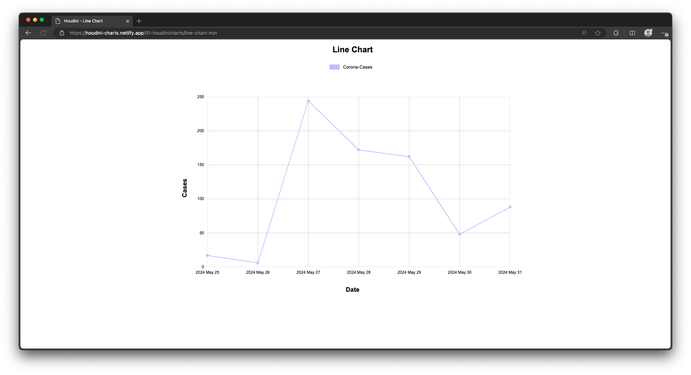
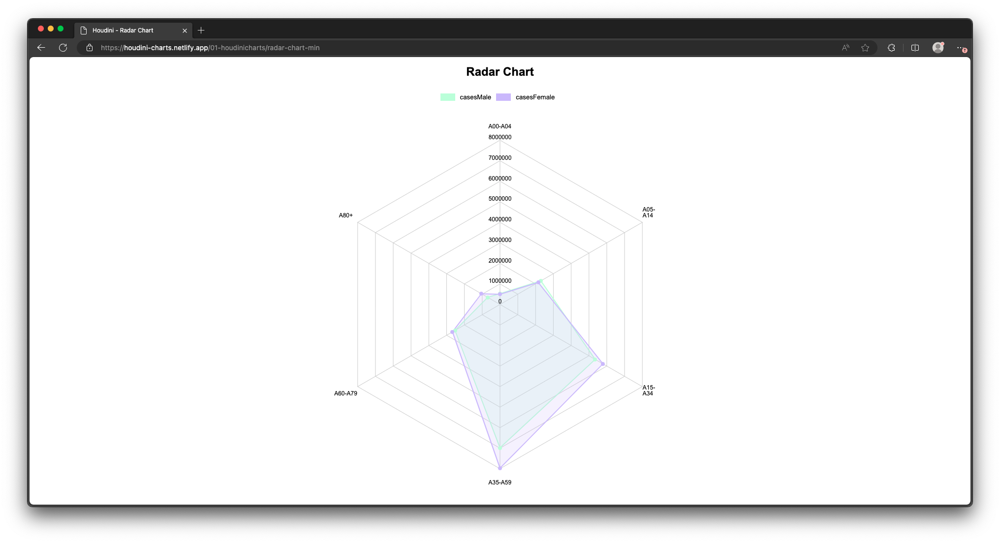

## Abstract

The subject of this elaboration is the evaluation of CSS Houdini for displaying interactive and performant diagrams on the web, in comparison to established technologies. For this purpose, a JavaScript library and a web application, in which the designed diagrams are visualized, will be developed. In the first part, the state of the art is analyzed by examining already established diagram libraries and comparing their technologies for the visualization of data. Thereupon, the architecture, the project structure, and the conception of the created components are described. Finally, the technology CSS Houdini is evaluated based on the developed library. The topic and the outcome of the bachelor thesis are relevant for people who are interested in the field of web development.

If you want to find out more about my project you can [download my thesis](https://github.com/christophsaile/houdini-charts/blob/master/docu/03-thesis/Bachelorarbeit-Christoph-Saile-260599.pdf) from my GitHub space.

## Result

As part my Bachelor thesis, the JavaScript library 'Houdini Charts' was developed to create performant, interactive, and accessible web charts. 'Houdini Charts' currently supports line and radar charts, rendered using HTML5 elements and CSS Houdini interfaces. A web application was also created to showcase the library's charts in various contexts.

Performance tests show that 'Houdini Charts' is 50% to 75% faster than 'Charts.js' and 'Highcharts' in most scenarios. Its components are well-suited for accessibility, and all planned interactive features were successfully implemented. The results confirm that CSS Houdini is effective for building interactive and performant web charts and can be considered for similar future projects. 'Houdini Charts' offers a valuable alternative to Canvas- and SVG-based chart libraries.

Further improvements and extensions for 'Houdini Charts' include enhancing browser compatibility with a 'Paint-API' polyfill for Safari and Firefox, and replacing certain APIs with standard JavaScript methods for broader browser support. Potential future features include additional chart types, customizable animations, and exploring the 'Layout API' for more efficient chart rendering.

