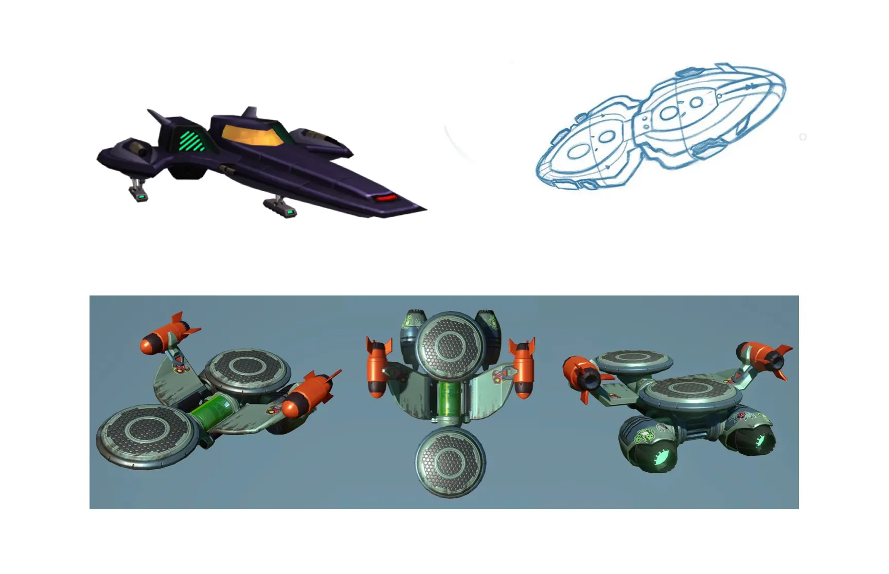
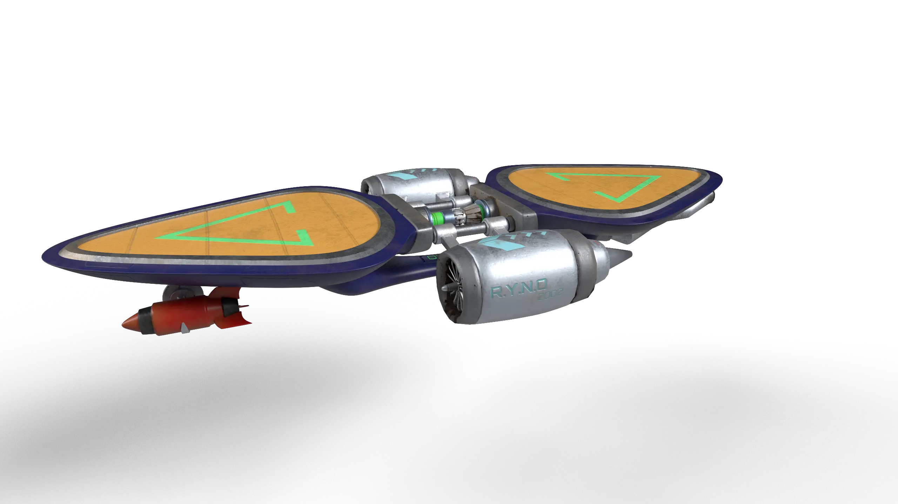
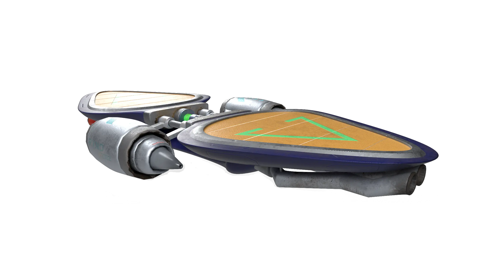
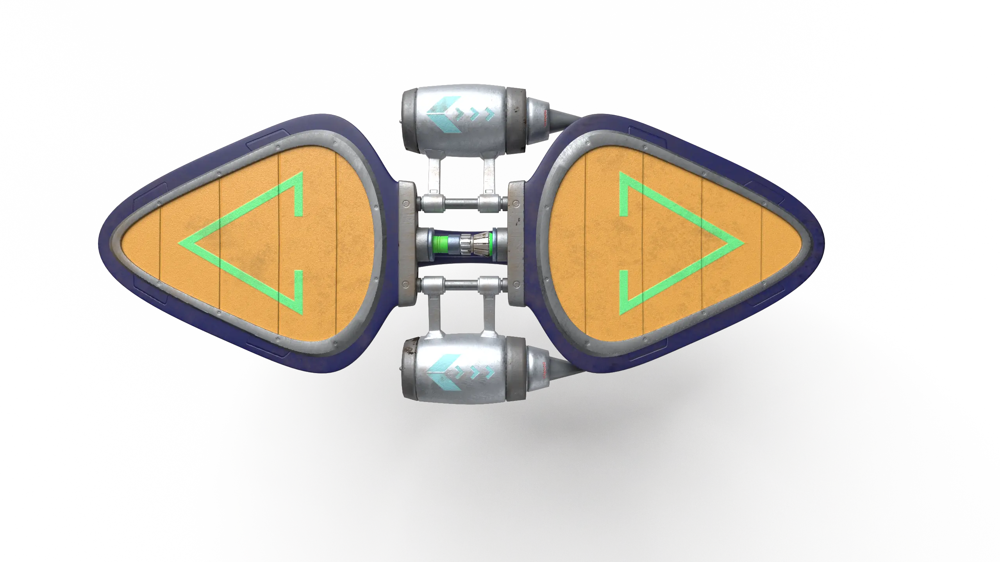
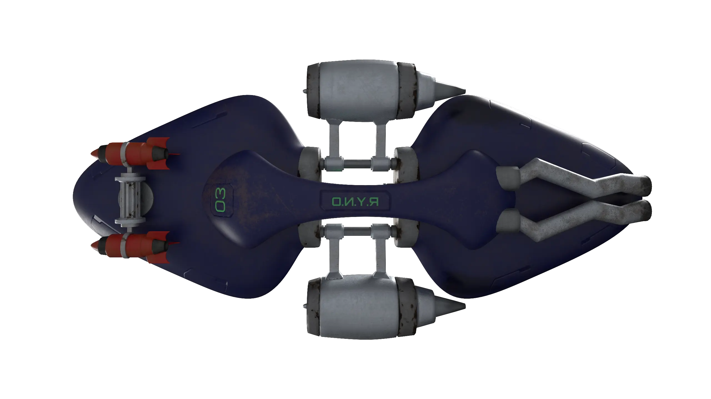

## References

As a main reference I used the already existing hoverboard. For the color scheme, I took my inspiration from the Blarg Starfighter. Both references are from the original 2002 game. The Blarg are a species and antagonists in Ratchet & Clank. The dark purple of the Blarg Starfighter was chosen to give the asset a darker and more extravagant look compared to the original's bluish-green metal.

The shape of the hoverboard was inspired by a sketch found on ArtStation. The elongated form of the board's standing surfaces parallels the front of the Blarg Starfighter.

The developed asset aims to have a slightly dark appearance like the Blarg Starfighter while retaining the typical features of Ratchet & Clank. These include the colorful, futuristic, and playful game look, along with the mechanical and technical elements of the items.

## Front View

When looking at the hoverboard, the rockets and their control elements can be seen. The rockets are painted in a bright red-orange, just like the original. Additionally, the propellers of the engines and the gearbox are visible, showing signs of rust and dirt. Upon closer inspection, notches on the sides of the standing surfaces can also be observed.

## Back View

From the back, the exhaust system and engines of the hoverboard can be seen. These show soot marks from the heat of the exhaust gases. The colors purple, orange, and green are intended to reflect the colors of the Blarg Starfighter.

## Top View

When viewed from above, the standing surfaces of the board are visible. The standing surfaces are made of a rough, slightly dirty material, which is adorned with a logo. Additionally, screws and notches can be seen, used to secure the metallic applications.

## Bottom View

From below, the connecting piece between the standing surfaces can be seen. It is labeled with the name and number of the hoverboard. The front part of the connecting piece is also heavily soiled from racing use.

